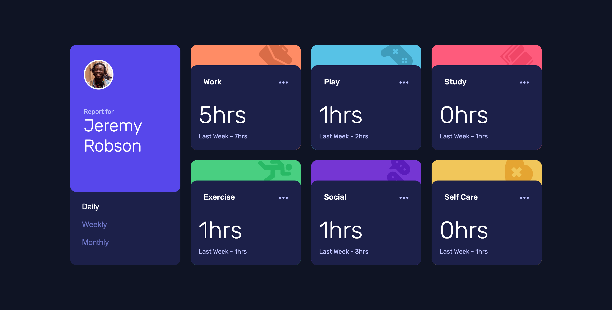
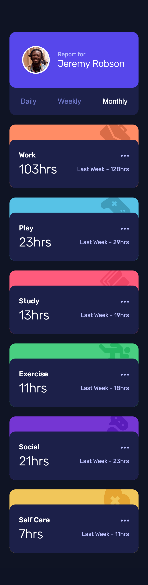

# Frontend Mentor - Time tracking dashboard solution

This is a solution to the [Time tracking dashboard challenge on Frontend Mentor](https://www.frontendmentor.io/challenges/time-tracking-dashboard-UIQ7167Jw). Frontend Mentor challenges help you improve your coding skills by building realistic projects.

## Table of contents

- [Overview](#overview)
  - [The challenge](#the-challenge)
  - [Screenshot](#screenshot)
  - [Links](#links)
- [My process](#my-process)
  - [Built with](#built-with)
  - [What I learned](#what-i-learned)
  - [Continued development](#continued-development)
  - [Useful resources](#useful-resources)
- [Author](#author)

## Overview

### The challenge

Users should be able to:

- View the optimal layout for the site depending on their device's screen size
- See hover states for all interactive elements on the page
- Switch between viewing Daily, Weekly, and Monthly stats

### Screenshot




### Links

- Solution URL: [Github](https://github.com/delroscol98/time-tracking-dashboard)
- Live Site URL: [Github Pages](https://your-live-site-url.com)

## My process

### Built with

- Semantic HTML5 markup
- CSS custom properties
- Flexbox
- CSS Grid
- Mobile-first workflow

### What I learned

Biggest I opener was using using the VS Code extension "Live Server" to allow usage of the Fetch API and work around CORS errors. Below is some code snippets that I am proud of:

The CSS below is an example of using custom utlity classes which use the clamp function. The clamp function allowed responsive growth and reduction

```css
.text-md {
  font-size: clamp(2.4rem, 2.778vw, 4rem);
}

.text-lg {
  font-size: clamp(3.2rem, 3.889vw, 5.6rem);
}
```

First time using the fetch API by myself :)

```js
fetch("./src/data.json")
  .then(
    (res) => {
      if (res.ok) return res.json();
      throw new Error("Unable to retrieve data.");
    },
    (networkError) => console.log(networkError.message)
  )
  .then((data) => {
    //Do stuff with data
  });
```

### Continued development

For future reference:

- Use live server more often, especially when using the fetch API
- Continual use of utility classes for simplified CSS
- Explore transition animations
- Continual use of accessible HTML

### Useful resources

- [Youtube](https://www.youtube.com/watch?v=nx8E5BF0XuE) - Helped my to use live server to work around CORS error

## Author

- Frontend Mentor - [@delroscol98](https://www.frontendmentor.io/profile/delroscol98)
